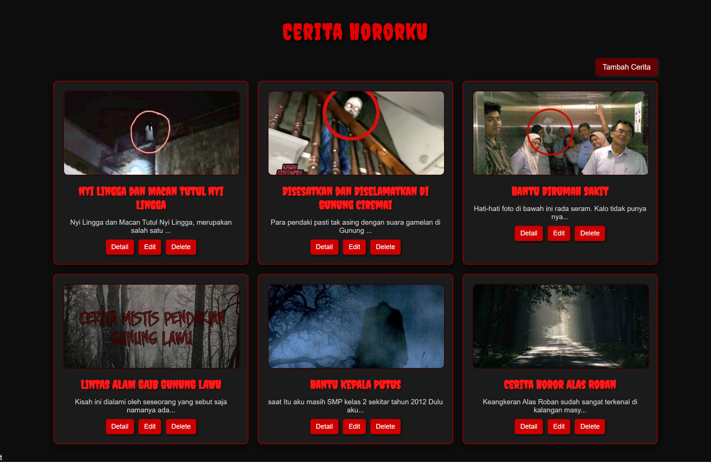
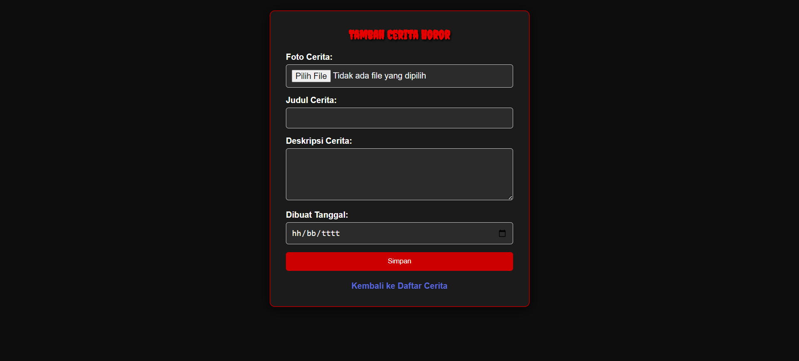
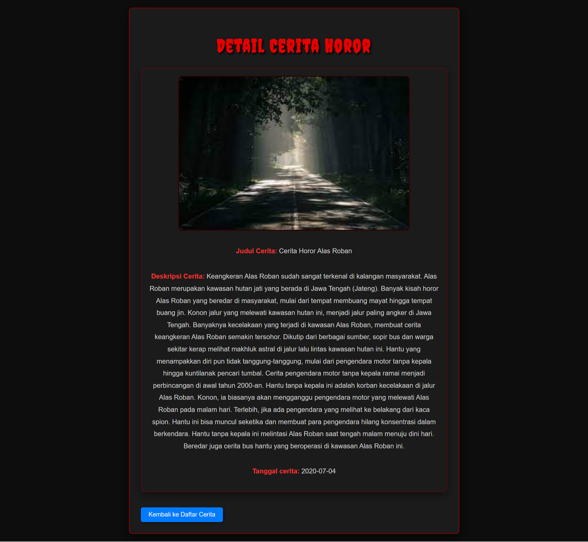
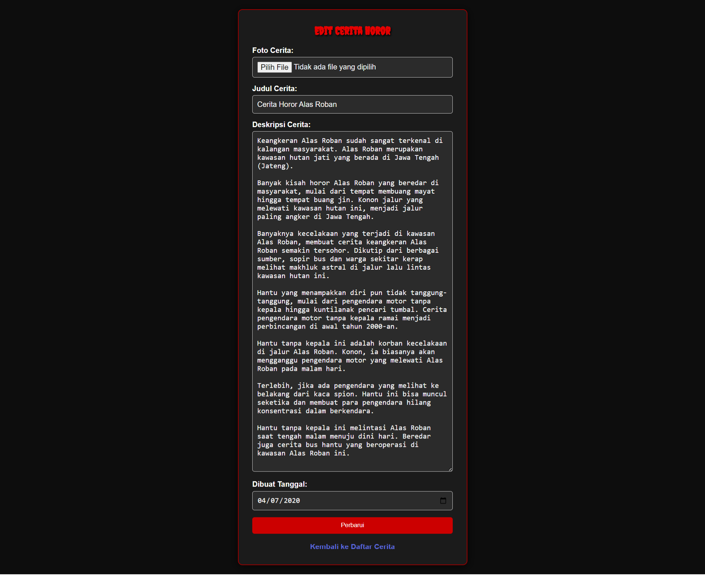

# 📖 Aplikasi Cerita Horor 👻

Selamat datang di **Aplikasi Cerita Horor**! 👻  
Aplikasi ini dirancang untuk memberikan platform bagi penggemar cerita horor untuk berbagi dan menemukan berbagai cerita menegangkan. Anda dapat menambahkan cerita Anda sendiri, mengedit, dan menghapus cerita yang telah ditambahkan. 

## 🚀 Fitur Utama

- **Daftar Cerita**: Menampilkan semua cerita horor yang telah ditambahkan lengkap dengan foto, judul, dan deskripsi singkat.
- **Tambah Cerita**: Fitur untuk menambahkan cerita baru beserta gambar dan deskripsi.
- **Detail Cerita**: Lihat informasi lengkap dari setiap cerita horor yang ditambahkan.
- **Edit dan Hapus Cerita**: Pengguna dapat mengedit atau menghapus cerita yang telah mereka tambahkan.

## 📚 Teknologi yang Digunakan

Proyek ini dibangun menggunakan teknologi-teknologi berikut:

- **HTML5**: Untuk struktur halaman aplikasi.
- **CSS3**: Untuk membuat desain antarmuka yang menarik dan responsif.
- **PHP**: Backend yang mengelola proses seperti menambah, mengedit, dan menghapus cerita.
- **SQLite**: Sebagai database untuk menyimpan semua informasi cerita horor yang ditambahkan.

## 💻 Dokumentasi

### Halaman Index
Pada halaman **index.php**, pengguna dapat melihat semua cerita horor yang telah ditambahkan. Setiap cerita menampilkan gambar, judul, dan deskripsi singkat. Pengguna dapat mengklik tombol untuk melihat detail, mengedit, atau menghapus cerita.

--------------------------------------------------------

### Halaman Tambah Cerita
Halaman ini memungkinkan pengguna untuk menambahkan cerita baru dengan memasukkan informasi seperti foto, judul cerita, dan deskripsi.

--------------------------------------------------------

### Halaman Detail Cerita
Pengguna bisa melihat detail lengkap dari cerita horor yang dipilih.

--------------------------------------------------------

### Halaman Edit Cerita
Pemilik cerita dapat mengedit informasi cerita yang telah mereka tambahkan melalui halaman ini.

--------------------------------------------------------

## 📝 Cara Menggunakan Aplikasi

1. **Melihat Cerita**: Buka halaman utama untuk melihat daftar cerita horor yang telah ditambahkan.
2. **Menambah Cerita**: Jika ingin menambahkan cerita baru, gunakan halaman **Tambah Cerita**.
3. **Melihat Detail Cerita**: Klik pada cerita untuk melihat detail lengkapnya.
4. **Mengedit atau Menghapus Cerita**: Pemilik dapat mengedit atau menghapus cerita yang mereka tambahkan dari daftar.

--------------------------------------------------------

# 🙏🏻 Terima Kasih 🙏🏻

Terima kasih telah menggunakan **Aplikasi Cerita Horor**! Selamat bercerita dan berbagi ketegangan! 🕷️
